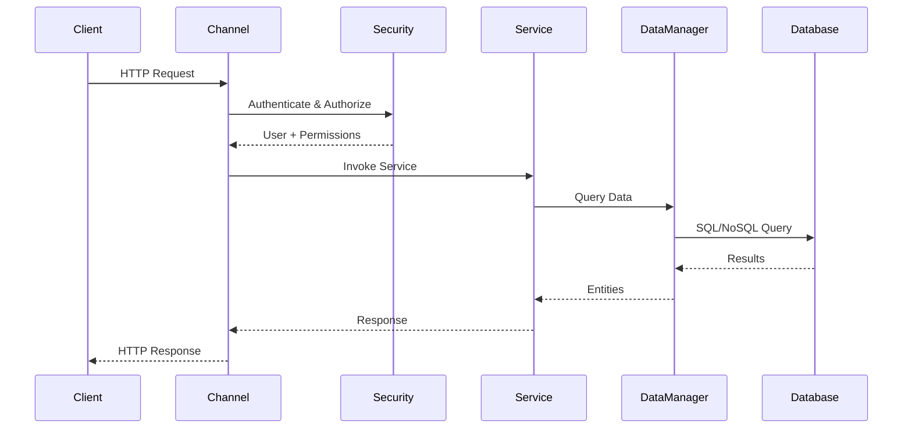

# Introduction to Laatoo

Welcome to Laatoo! This guide introduces you to the Laatoo platform, its architecture, and core concepts.

## What is Laatoo?

Laatoo is a comprehensive application development platform that provides everything you need to build modern, scalable, multi-tenant enterprise applications. It combines:

- **Backend Framework**: Go-based server with services, workflows, and data management
- **Frontend Framework**: React-based UI with declarative components
- **Plugin System**: Modular architecture for reusable components
- **CLI Tools**: Complete development toolchain
- **Multi-Tenancy**: Built-in support for SaaS applications

## Core Philosophy

Laatoo is built on several key principles:

### 1. Plugin-Based Modularity

Everything in Laatoo is a plugin. This means:
- **Reusability**: Write once, use across projects
- **Isolation**: Plugins don't interfere with each other
- **Extensibility**: Add functionality without modifying core
- **Shareability**: Distribute plugins to other developers

### 2. Hierarchical Organization

Laatoo uses a three-level hierarchy:

```
Solution (System)
  ├── Application 1 (Functional Area)
  │   ├── Isolation A (Tenant/Environment)
  │   └── Isolation B (Tenant/Environment)
  └── Application 2 (Functional Area)
      └── Isolation C (Tenant/Environment)
```

**Benefits**:
- **Separation of Concerns**: Each level has its configuration and plugins
- **Multi-Tenancy**: Isolations provide complete data and code separation
- **Configuration Inheritance**: Child levels inherit from parents
- **Flexible Deployment**: Scale by adding isolations

### 3. Declarative Configuration

Most Laatoo components are defined declaratively:
- **Entities**: YAML definitions
- **Services**: Configuration + minimal code
- **Workflows**: YAML-based process definitions
- **UI Components**: XML/YAML declarations
- **Security**: Configuration files

This approach means less code, faster development, and easier maintenance.

### 4. Developer Experience

Laatoo prioritizes developer productivity:
- **Hot Reloading**: See changes instantly
- **CLI Tools**: Scaffold, build, run from command line
- **Type Safety**: Go's type system + TypeScript support
- **Clear Abstractions**: Well-defined interfaces

## Architecture Overview

### Server Architecture

```
┌─────────────────────────────────────────────────┐
│              Laatoo Server Core                  │
│  ┌──────────────────────────────────────────┐  │
│  │         Manager Layer                     │  │
│  │  • Service Manager                        │  │
│  │  • Data Manager                           │  │
│  │  • Security Handler                       │  │
│  │  • Channel Manager                        │  │
│  │  • Workflow Manager                       │  │
│  │  • Task Manager                           │  │
│  └──────────────────────────────────────────┘  │
│  ┌──────────────────────────────────────────┐  │
│  │         Plugin Layer                      │  │
│  │  ┌────────────┬────────────┬──────────┐ │  │
│  │  │  Plugin A  │  Plugin B  │ Plugin C │ │  │
│  │  │            │            │          │ │  │
│  │  │ Services   │ Services   │ Services │ │  │
│  │  │ Entities   │ Entities   │ Entities │ │  │
│  │  │ Workflows  │ Workflows  │ Workflows│ │  │
│  │  └────────────┴────────────┴──────────┘ │  │
│  └──────────────────────────────────────────┘  │
└─────────────────────────────────────────────────┘
```

**Key Components**:

1. **Services**: Business logic endpoints
2. **Entities**: Data models with automatic CRUD
3. **Data Manager**: Database abstraction layer
4. **Security Handler**: Authentication and authorization
5. **Workflow Manager**: Process orchestration
6. **Task Manager**: Background job processing
7. **Channel Manager**: API endpoint management

### UI Architecture

```
┌─────────────────────────────────────────────────┐
│            Laatoo UI Framework                   │
│  ┌──────────────────────────────────────────┐  │
│  │         Core Components                   │  │
│  │  • Page Router                            │  │
│  │  • Form Engine                            │  │
│  │  • View Engine                            │  │
│  │  • Action Dispatcher                      │  │
│  │  • Data Service Layer                     │  │
│  └──────────────────────────────────────────┘  │
│  ┌──────────────────────────────────────────┐  │
│  │         UI Plugins                        │  │
│  │  ┌────────────┬────────────┬──────────┐ │  │
│  │  │  Plugin A  │  Plugin B  │ Plugin C │ │  │
│  │  │            │            │          │ │  │
│  │  │ Pages      │ Pages      │ Pages    │ │  │
│  │  │ Forms      │ Forms      │ Forms    │ │  │
│  │  │ Views      │ Views      │ Views    │ │  │
│  │  │ Blocks     │ Blocks     │ Blocks   │ │  │
│  │  └────────────┴────────────┴──────────┘ │  │
│  └──────────────────────────────────────────┘  │
└─────────────────────────────────────────────────┘
```

**Key Components**:

1. **Pages**: Route-based screens
2. **Forms**: Data entry with validation
3. **Views**: Data display with filtering/pagination
4. **Blocks**: Reusable UI components
5. **Actions**: User interaction handlers
6. **Datasets**: Data querying and caching

## Request Flow

Here's how a typical request flows through Laatoo:



**Steps**:
1. **Request arrives** at a Channel (HTTP, gRPC, etc.)
2. **Security Handler** authenticates user and checks permissions
3. **Service** is invoked with request context
4. **Service** uses Data Manager to access data
5. **Data Manager** abstracts database operations
6. **Response** flows back through the chain

## Development Workflow

### Typical Development Cycle

1. **Plan**: Define your solution structure
2. **Create**: Use CLI to scaffold solution and plugins
3. **Define**: Create entities, services, and UI components
4. **Build**: Compile plugins
5. **Run**: Test locally with hot reload
6. **Deploy**: Package and deploy to production

### File Organization

```
my-solution/
├── applications/
│   └── myapp/
│       ├── config/
│       │   ├── modules/           # Installed plugins
│       │   ├── security/          # Security config
│       │   └── properties/        # Application properties
│       └── isolations/
│           └── default/
│               └── config/
└── dev/
    └── plugins/
        ├── server-plugin/         # Server plugin dev
        │   ├── config/
        │   │   ├── entities/      # Entity definitions
        │   │   ├── services/      # Service configs
        │   │   └── workflows/     # Workflow definitions
        │   └── src/
        │       └── server/go/     # Go code
        └── ui-plugin/             # UI plugin dev
            ├── config/
            │   └── ui/
            │       ├── pages/     # Page definitions
            │       ├── forms/     # Form definitions
            │       └── views/     # View definitions
            └── src/
                └── ui/            # React code
```

## Core Concepts

### Entities

Entities are your data models:

```yaml
# Entity definition (YAML)
name: Student
attributes:
  - name: StudentId
    type: string
    primary: true
  - name: Name
    type: string
    required: true
  - name: Email
    type: string
    unique: true
  - name: EnrollmentDate
    type: datetime
```

Laatoo automatically generates:
- Database schema
- CRUD operations
- REST API endpoints
- Data validation

### Services

Services contain business logic:

```go
// Service implementation
type StudentService struct {
    core.Service
    dataManager elements.DataManager
}

func (s *StudentService) Invoke(ctx core.RequestContext) error {
    // Get parameter from request
    studentId, ok := ctx.GetStringParam("id")
    if !ok {
        ctx.SetResponse(core.StatusBadRequestResponse)
        return nil
    }
    
    // Access data through DataManager
    student, err := s.dataManager.GetById(ctx, "Student", studentId, "")
    if err != nil {
        return err
    }
    
    // Return response
    ctx.SetResponse(&core.Response{
        Status: core.StatusOK,
        Data:   student,
    })
    return nil
}
```

### Workflows

Workflows orchestrate complex processes:

```yaml
# Workflow definition
workflow:
  sequence:
    elements:
      - activity:
          name: validateExam
          arguments: {examId: "$examId"}
          result: validation
      - activity:
          name: calculateScore
          arguments: {attempt: "$attempt"}
          result: score
      - activity:
          name: saveResult
          arguments: {score: "$score"}
```

### UI Components

UI is declaratively defined:

```yaml
# Page definition
route: "/students"
authenticate: true
component:
  type: layout
  layout: 2col
  leftcol:
    type: menu
    id: mainmenu
  rightcol:
    type: view
    id: studentlist
```

```xml
<!-- Form definition -->
<Form form="student_create" module="formikforms" action="createstudent">
    <Field type="string" name="Name" className="w100" module="formikforms"/>
    <Field type="email" name="Email" className="w100" module="formikforms"/>
    <Field type="date" name="EnrollmentDate" module="formikforms"/>
</Form>
```

## Multi-Tenancy

Laatoo's isolation model provides complete multi-tenancy:

### Data Isolation
Each isolation can have:
- Separate database
- Own data encryption keys
- Independent backup schedules

### Code Isolation
Each isolation can have:
- Tenant-specific plugins
- Custom workflows
- Unique configurations

### Configuration Inheritance
```
Solution Config (Shared settings)
  ↓
Application Config (App-specific overrides)
  ↓
Isolation Config (Tenant-specific overrides)
```

## Security Model

### Authentication
- **JWT Tokens**: Secure token-based auth
- **Multiple Providers**: Support for OAuth, SAML, etc.
- **Session Management**: Built-in session handling

### Authorization
- **Role-Based Access Control (RBAC)**: Define roles and permissions
- **Service-Level**: Control access to services
- **Object-Level**: Fine-grained data access control
- **Casbin Integration**: Policy-based authorization

### Example Security Config
```yaml
# Security configuration
security:
  authservices:
    - login.local
  publickey: keys/app.pub
  pvtkey: keys/app.pem
  __user: auth.User
  __role: auth.Role
```

## Next Steps

Now that you understand Laatoo's architecture and concepts:

1. **[Setup](02-setup.md)**: Install Laatoo and set up your development environment
2. **[First Solution](03-first-solution.md)**: Create your first Laatoo application
3. **[Tutorial](../tutorials/student-management/00-overview.md)**: Follow the complete Student Management System tutorial

## Further Reading

- [Server Development Guide](../guides/server-development/creating-plugins.md)
- [UI Development Guide](../guides/ui-development/creating-ui-plugins.md)
- [Architecture Deep Dive](/home/mandeep/goprogs/src/laatoo/docs/server/architecture/hierarchy-overview.md)
