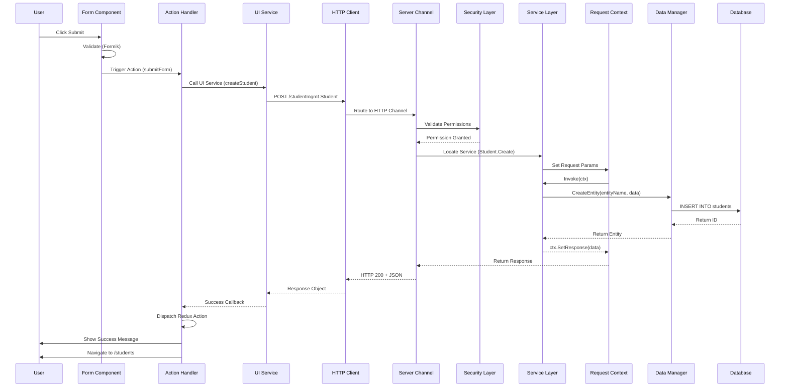
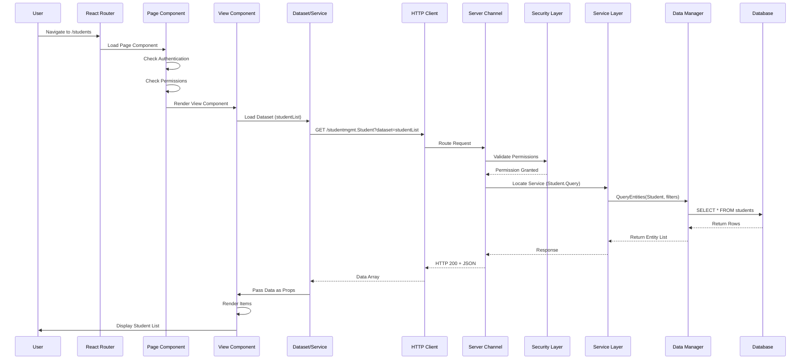
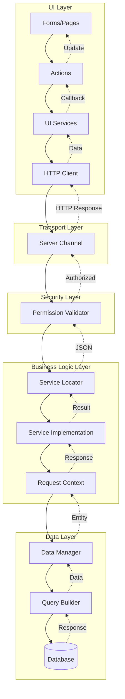

# End-to-End Request Flows

This guide documents the complete request flow in Laatoo applications, from user interaction to database persistence and back.

## Table of Contents

1. [Form Submission Flow](#form-submission-flow)
2. [View/Page Loading Flow](#viewpage-loading-flow)
3. [Architecture Overview](#architecture-overview)

---

## Form Submission Flow

This section details the complete flow when a user submits a form to create or update data.

### Flow Diagram



### Detailed Step-by-Step Flow

#### 1. User Interface Layer

**User Interaction**
```javascript
// User fills form and clicks submit button
<Form form="student_enrollment" module="formikforms" action="submitEnrollment">
  <Field type="string" name="Name" module="formikforms"/>
  <Field type="email" name="Email" module="formikforms"/>
  <Button type="submit">Enroll Student</Button>
</Form>
```

**Form Validation (Formik)**
```javascript
// Formik validates fields before submission
validateForm: (values) => {
  const errors = {};
  if (!values.Name) errors.Name = 'Required';
  if (!values.Email) errors.Email = 'Required';
  return errors;
}
```

#### 2. Action Layer

**Action Definition**
```yaml
# src/ui/registry/Actions/submitEnrollment.yml
actiontype: executeservice
servicename: createStudent
actionparams:
  successaction: navigateToDashboard
```

**Or Method-Based Action**
```javascript
// src/ui/registry/Methods/enrollStudent.js
function enrollStudent(payload, actionparams, event, form) {
  if (form) {
    form.setSubmitting(true);
  }
  
  // Call UI Service
  Window.executeService(
    'createStudent',
    payload,
    null,
    successCallback,
    errorCallback
  );
}
```

#### 3. UI Service Layer

**Service Definition**
```yaml
# src/ui/registry/Services.yml
createStudent:
  method: POST
  url: /studentmgmt.Student
```

**Service Execution**
```javascript
// Window.executeService internally calls:
Window.executeService = function(svcName, payload, urlparams, successfunc, errorfunc) {
  let req = RequestBuilder.DefaultRequest(null, payload, null, urlparams);
  DataSource.ExecuteService(svcName, req).then(successfunc).catch(errorfunc);
}
```

#### 4. HTTP Client Layer

**Request Builder**
```javascript
// RequestBuilder creates the HTTP request
RequestBuilder.DefaultRequest(headers, payload, query, urlParams)
// Returns: { headers, body: payload, urlParams }
```

**DataSource - HTTP Call**
```javascript
// DataSource.ExecuteService makes actual HTTP call
DataSource.ExecuteService('createStudent', request)
// Looks up service definition
// Makes POST request to /studentmgmt.Student
```

#### 5. Server Channel Layer

**Channel Configuration**
```yaml
# Server: config/channels/http.yml
protocol: http
port: 8080
routes:
  - path: /:module.:entity
    methods: [GET, POST, PUT, DELETE]
  - path: /:module.:entity/:id
    methods: [GET, PUT, DELETE]
```

**Channel Request Handler**
```go
// Server receives HTTP POST /studentmgmt.Student
func (h *HTTPChannel) HandleRequest(w http.ResponseWriter, r *http.Request) {
    // Parse route params: module=studentmgmt, entity=Student
    // Create ServerContext
    ctx := server.CreateNewRequest(module, entity, method)
    
    // Parse request body
    ctx.SetData(requestBody)
    
    // Route to security layer
    h.ValidatePermissions(ctx)
}
```

#### 6. Security/Permission Layer

**Permission Validation**
```go
//  Check user permissions
func ValidatePermissions(ctx *ServerContext) error {
    user := ctx.GetUser()
    service := ctx.GetServicePath() // "studentmgmt.Student.Create"
    
    // Check Casbin policy
    allowed := enforcer.Enforce(user.Role, service, "execute")
    if !allowed {
        return errors.New("Permission denied")
    }
    
    return nil
}
```

**Security Configuration**
```csv
# config/security/roles/Teacher.csv
p, Teacher, studentmgmt.Student.Create, execute
p, Teacher, studentmgmt.Student.Query, execute
p, Teacher, studentmgmt.Student.Update, execute
```

#### 7. Service Layer

**Service Location**
```go
// Locate the service
service := ctx.GetService("studentmgmt.Student.Create")
```

**Service Definition**
```yaml
# Server plugin: config/services/Student.yml
Student.Create:
  Description: Create new student
  Request:
    Name: string
    Email: string
    Grade: integer
    DateOfBirth: datetime
```

**Service Implementation**
```go
// src/server/services/Student.go
type StudentService struct {
    dataComponent interfaces.DataComponent
}

func (s *StudentService) Invoke(ctx interfaces.ServerContext) error {
    // Get parameters from context
    name := ctx.GetParamValue("Name")
    email := ctx.GetParamValue("Email")
    grade := ctx.GetParamValue("Grade")
    dob := ctx.GetParamValue("DateOfBirth")
    
    // Validate
    if name == "" || email == "" {
        return ctx.SetError("Name and Email are required")
    }
    
    // Create entity data
    studentData := map[string]interface{}{
        "Name": name,
        "Email": email,
        "Grade": grade,
        "DateOfBirth": dob,
    }
    
    // Call Data Manager
    result, err := s.dataComponent.CreateEntity("studentmgmt.Student", studentData)
    if err != nil {
        return err
    }
    
    // Set response
    ctx.SetResponse(result)
    return nil
}
```

#### 8. Request Context Layer

**Context Operations**
```go
// Request Context manages request lifecycle
type ServerContext interface {
    // Parameter access
    GetParamValue(key string) interface{}
    SetParam(key string, value interface{})
    
    // Data access
    GetData() map[string]interface{}
    SetData(data map[string]interface{})
    
    // Response
    SetResponse(data interface{})
    SetError(message string) error
    
    // User context
    GetUser() *User
}
```

#### 9. Data Manager Layer

**DataComponent Interface**
```go
type DataComponent interface {
    CreateEntity(entityName string, data map[string]interface{}) (interface{}, error)
    UpdateEntity(entityName string, id string, data map[string]interface{}) error
    DeleteEntity(entityName string, id string) error
    GetEntity(entityName string, id string) (interface{}, error)
    QueryEntities(entityName string, query QueryBuilder) ([]interface{}, error)
}
```

**Entity Creation**
```go
func (dm *DataManager) CreateEntity(entityName string, data map[string]interface{}) (interface{}, error) {
    // Get entity definition
    entityDef := dm.GetEntityDefinition(entityName)
    
    // Validate data against entity schema
    err := dm.ValidateEntity(entityDef, data)
    if err != nil {
        return nil, err
    }
    
    // Generate ID
    data["Id"] = dm.GenerateID()
    data["CreatedAt"] = time.Now()
    data["UpdatedAt"] = time.Now()
    
    // Insert into database
    err = dm.db.Insert(entityDef.TableName, data)
    if err != nil {
        return nil, err
    }
    
    // Return created entity
    return data, nil
}
```

#### 10. Database Layer

**Entity Definition**
```yaml
# config/entities/Student.yml
Student:
  Properties:
    Id:
      Type: uuid
      PrimaryKey: true
    Name:
      Type: string
      Required: true
    Email:
      Type: string
      Required: true
    Grade:
      Type: integer
    DateOfBirth:
      Type: datetime
    CreatedAt:
      Type: datetime
    UpdatedAt:
      Type: datetime
```

**SQL Execution**
```sql
-- Generated SQL
INSERT INTO students (
    Id, Name, Email, Grade, DateOfBirth, CreatedAt, UpdatedAt
) VALUES (
    'uuid-here', 'John Doe', 'john@example.com', 10, '2010-01-01', NOW(), NOW()
)
RETURNING *;
```

#### 11. Response Flow (Back to UI)

**Response Path**
```
Database → DataManager → Service → Context → Channel → HTTP → DataSource → UIService → Action → UI
```

**Success Callback**
```javascript
function successCallback(response) {
  // response.data contains the created student
  
  // Update Redux store
  Application.store.dispatch({
    type: 'STUDENT_ENROLLED',
    payload: response.data
  });
  
  // Show success message
  Window.showMessage({ Default: 'Student enrolled successfully!' });
  
  // Navigate
  Window.redirectPage('/students');
}
```

---

## View/Page Loading Flow

This section details the complete flow when a user navigates to a page with data views.

### Flow Diagram



### Detailed Step-by-Step Flow

#### 1. Page Navigation

**Route Configuration**
```yaml
# src/ui/registry/Pages/students.yml
route: "/students"
authenticate: true
roles: [Teacher, Admin]
component:
  type: layout
  layout: 2col
  leftcol:
    type: menu
    id: main-menu
  rightcol:
    type: view
    id: student-list
```

**React Router**
```javascript
// Application routes students page
<Route path="/students" component={StudentsPage} />
```

#### 2. Page Component Loading

**Page Initialization**
```javascript
// StudentsPage component loads
function StudentsPage(props) {
  const pageContext = usePage Context();
  
  // Check authentication
  if (!Application.user) {
    Window.redirectPage('/login');
    return null;
  }
  
  // Check permissions
  if (!hasPermission('studentmgmt.Student.Query')) {
    return <AccessDenied />;
  }
  
  return <TwoColumnLayout leftCol={<Menu />} rightCol={<StudentListView />} />;
}
```

#### 3. View Component

**View Definition**
```yaml
# src/ui/registry/Views/student-list.yml
title: Students
dataset: studentList
pagination: true
pageSize: 20

item:
  type: block
  id: student-card

filters:
  Grade: [[ctx.selectedGrade]]
  Status: active
```

**View Component Initialization**
```javascript
// View component loads
function StudentListView(props) {
  const [data, setData] = useState([]);
  const [loading, setLoading] = useState(true);
  
  useEffect(() => {
    loadData();
  }, []);
  
  async function loadData() {
    const dataset = _reg('Datasets', 'studentList');
    const result = await dataset.load(filters);
    setData(result);
    setLoading(false);
  }
  
  return (
    <div>
      {loading && <Spinner />}
      {data.map(student => <StudentCard key={student.Id} data={student} />)}
    </div>
  );
}
```

#### 4. Dataset Layer

**Dataset Definition**
```yaml
# src/server/datasets/studentList.yml
service: studentmgmt.Student.Query
filters:
  Status: active
orderby: Name ASC
select:
  - Id
  - Name
  - Email
  - Grade
  - EnrollmentDate
```

**Dataset Execution**
```javascript
// Dataset loads data
class Dataset {
  async load(additionalFilters) {
    const filters = { ...this.config.filters, ...additionalFilters };
    
    const request = RequestBuilder.DefaultRequest(null, {
      filters: filters,
      orderby: this.config.orderby,
      select: this.config.select,
      limit: this.pageSize
    });
    
    const response = await DataSource.ExecuteService(this.config.service, request);
    return response.data;
  }
}
```

#### 5. Server-Side Query Processing

The service receives the query request and uses the DataComponent to fetch data from the database. The DataComponent handles building SQL queries, executing them, and mapping results back to entity objects.

```go
func (s *StudentService) Query(ctx interfaces.ServerContext) error {
    // Get query parameters from context
    filters := ctx.GetParamValue("filters")
    orderBy := ctx.GetParamValue("orderby")
    limit := ctx.GetParamValue("limit")
    
    // Use DataComponent to query entities
    // The DataComponent handles SQL generation, execution, and mapping

    if err != nil {
        return err
    }
    
    // Set response
    ctx.SetResponse(results)
    return nil
}
```

The DataComponent internally:
1. Builds a SQL query based on the parameters
2. Executes the query against the database
3. Maps database rows to entity objects
4. Returns the result set

#### 7. Data Rendering

**Item Rendering**
```xml
<!-- src/ui/registry/Blocks/student-card.xml -->
<Block className="student-card">
  <Block className="student-header">
    <h3 module="html">{{data.Name}}</h3>
    <span className="grade">Grade {{data.Grade}}</span>
  </Block>
  
  <Block className="student-details">
    <p module="html">Email: {{data.Email}}</p>
    <p module="html">Enrolled: {{data.EnrollmentDate}}</p>
  </Block>
  
  <Block className="student-actions">
    <Button action="viewStudent" actionparams=[[{studentId: data.Id}]]>
      View Details
    </Button>
  </Block>
</Block>
```

---

## Architecture Overview

### Layered Architecture



### Component Responsibilities

| Layer | Components | Responsibilities |
|-------|-----------|------------------|
| **UI** | Forms, Pages, Views, Actions | User interaction, validation, state management |
| **Service** | UI Services, Methods, Sagas | Business logic, orchestration, error handling |
| **Transport** | HTTP Client, Channels | Network communication, routing |
| **Security** | Auth, Permissions | Authentication, authorization |
| **Business** | Services, Context | Core business logic, parameter handling |
| **Data** | DataManager, QueryBuilder | Database operations, entity management |
| **Storage** | Database | Data persistence |

---

## Complete Example: Student Enrollment

### UI Code

```javascript
// Form submission
function enrollStudent(payload, actionparams, event, form) {
  Window.executeService('createStudent', payload, null,
    function(response) {
      Application.store.dispatch({ type: 'STUDENT_ENROLLED', payload: response.data });
      Window.showMessage({ Default: 'Student enrolled!' });
      Window.redirectPage('/students');
    },
    function(error) {
      Window.showError({ Default: 'Enrollment failed' });
    }
  );
}
```

### Server Code

```go
func (s *StudentService) Create(ctx interfaces.ServerContext) error {
    studentData := map[string]interface{}{
        "Name": ctx.GetParamValue("Name"),
        "Email": ctx.GetParamValue("Email"),
        "Grade": ctx.GetParamValue("Grade"),
    }
    
    result, err := s.dataComponent.CreateEntity("studentmgmt.Student", studentData)
    if err != nil {
        return err
    }
    
    ctx.SetResponse(result)
    return nil
}
```

### Configuration Files

```yaml
# Entity
Student:
  Properties:
    Name: { Type: string, Required: true }
    Email: { Type: string, Required: true }
    Grade: { Type: integer }

# Service
Student.Create:
  Request:
    Name: string
    Email: string
    Grade: integer

# Security
# roles/Teacher.csv
p, Teacher, studentmgmt.Student.Create, execute

# UI Service
createStudent:
  method: POST
  url: /studentmgmt.Student
```

---

## Performance Considerations

1. **Caching**: Dataset results can be cached
2. **Pagination**: Large lists use server-side pagination
3. **Lazy Loading**: Views load data on demand
4. **Connection Pooling**: Database connections are pooled
5. **Request Batching**: Multiple requests can be batched

## Security Checkpoints

1. **Client Validation**: Forms validate before submission
2. **Authentication**: Server verifies user identity
3. **Authorization**: Permissions checked before service execution
4. **Input Sanitization**: Parameters validated and sanitized
5. **SQL Injection Prevention**: Query builder uses parameterized queries

## Error Handling

Errors propagate back through the same path:
```
Database Error → DataManager → Service → Context → Channel → HTTP → Client → UI
```

Each layer can add context and transform errors appropriately.

## See Also

- [Forms](../ui-development/forms.md)
- [Actions](../ui-development/actions.md)
- [UI Services](../ui-development/ui-services.md)
- [Services](../server-development/services.md)
- [Entities](../server-development/entities.md)
- [Security](../server-development/security.md)
