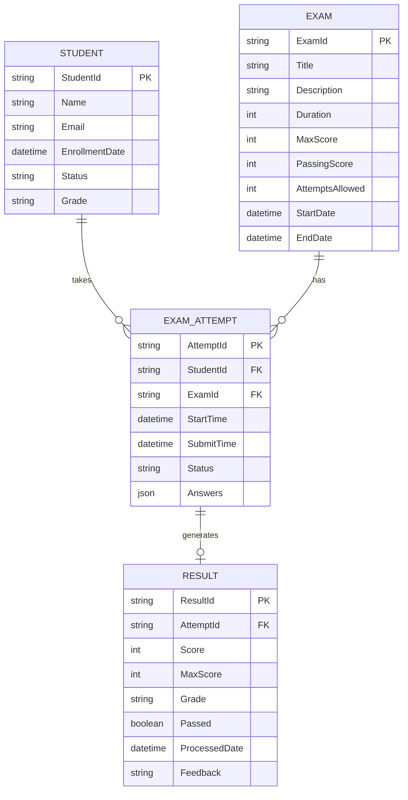

# Student Management System Tutorial

Welcome to the Laatoo Student Management System (SMS) tutorial! This comprehensive, hands-on guide will walk you through building a complete multi-tenant application from scratch.

## What You'll Build

A fully-functional Student Management System with:

### Core Features
1. **Student Management**
   - Student registration with personal details
   - Student profiles and records
   - Search and filter students
   - Student status tracking (active, graduated, suspended)

2. **Exam Management**
   - Create and configure exams
   - Assign exams to students
   - Set exam parameters (duration, passing score, attempts allowed)
   - Track exam scheduling

3. **Exam Submission & Grading**
   - Students submit exam attempts
   - Automated or manual grading workflows
   - Score calculations
   - Grade verification

4. **Results & Reporting**
   - Individual result records
   - Results dashboard with analytics
   - Performance reports
   - Pass/fail statistics
   - Export capabilities

### Technical Components

**Backend (Server Plugin)**:
- **Entities**: Student, Exam, ExamAttempt, Result
- **Services**: StudentService, ExamService, SubmissionService, ResultService
- **Workflows**: ExamProcessingWorkflow, ResultGenerationWorkflow
- **Tasks**: ScoreCalculationTask, NotificationTask
- **Security**: Role-based access (Student, Teacher, Admin)
- **Channels**: REST APIs for all operations

**Frontend (UI Plugin)**:
- **Pages**: Dashboard, Students, Exams, Results
- **Forms**: StudentRegistration, ExamCreation, ExamSubmission
- **Views**: StudentList, ExamList, ResultsList, MyExams
- **Blocks**: StudentCard, ExamCard, ResultSummary, StatisticsWidget
- **Actions**: EnrollStudent, StartExam, SubmitExam, ViewResults
- **Services**: Student DataService, ExamDataService, ResultDataService

## Architecture Overview

```
┌──────────────────────────────────────────────────────┐
│           Student Management Solution                 │
│  ┌────────────────────────────────────────────────┐  │
│  │       Education Application                    │  │
│  │  ┌──────────────────────────────────────────┐ │  │
│  │  │   School-A Isolation (Tenant 1)          │ │  │
│  │  │  ┌────────────┬──────────────────────┐  │ │  │
│  │  │  │ Server     │  UI Plugin           │  │ │  │
│  │  │  │ Plugin     │                      │  │ │  │
│  │  │  │ ─────────  │  ──────────────────  │  │ │  │
│  │  │  │ Students   │  Student Pages       │  │ │  │
│  │  │  │ Exams      │  Exam Views          │  │ │  │
│  │  │  │ Results    │  Result Dashboards   │  │ │  │
│  │  │  │ Workflows  │  Forms & Actions     │  │ │  │
│  │  │  └────────────┴──────────────────────┘  │ │  │
│  │  └──────────────────────────────────────────┘ │  │
│  │  ┌──────────────────────────────────────────┐ │ │
│  │  │   School-B Isolation (Tenant 2)          │ │  │
│  │  │  (Same structure, isolated data)         │ │  │
│  │  └──────────────────────────────────────────┘ │  │
│  └────────────────────────────────────────────────┘  │
└──────────────────────────────────────────────────────┘
```

## Data Model



## User Roles & Permissions

### Student Role
- View own profile
- Browse available exams
- Take assigned exams
- View own results
- Cannot see other students' data

### Teacher Role
- View all students
- Create and manage exams
- Assign exams to students
- View all exam attempts
- Grade submissions (manual mode)
- View all results

### Admin Role
- All teacher permissions
- Manage users and roles
- Configure system settings
- Access analytics and reports
- Manage workflows

## Tutorial Structure

This tutorial is divided into 10 progressive chapters:

### 1. [Overview](00-overview.md) ← You are here
Understanding what we'll build and why.

### 2. [Setup Solution](01-setup-solution.md)
Create the solution, application, and basic structure.

### 3. [Data Model](02-data-model.md)
Define entities for Student, Exam, ExamAttempt, and Result.

### 4. [Server Plugin](03-server-plugin.md)
Create services for CRUD operations and business logic.

### 5. [Workflows](04-workflows.md)
Build automated workflows for exam processing and result generation.

### 6. [UI Plugin](05-ui-plugin.md)
Set up the UI plugin structure and navigation.

### 7. [Forms](06-forms.md)
Create forms for student registration and exam submission.

### 8. [Views & Lists](07-views-lists.md)
Build data views for browsing students, exams, and results.

### 9. [Dashboards](08-dashboards.md)
Create interactive dashboards with charts and statistics.

### 10. [Deployment](09-deployment.md)
Package and deploy the system to production.

## Prerequisites

Before starting this tutorial, you should:

1. **Complete the Getting Started guides**:
   - [Introduction](../../getting-started/01-introduction.md)
   - [Setup](../../getting-started/02-setup.md)
   - [First Solution](../../getting-started/03-first-solution.md)

2. **Have basic knowledge of**:
   - Go programming (for server development)
   - JavaScript/React (for UI development)
   - YAML (for configurations)
   - SQL/databases (basic understanding)

3. **Have installed**:
   - Laatoo CLI
   - Go 1.19+
   - Node.js 16+
   - Docker or PostgreSQL

## Time Estimate

- **Quick Path** (following tutorial exactly): 4-6 hours
- **Learning Path** (experimenting and exploring): 8-12 hours
- **Complete Path** (adding custom features): 15-20 hours

## Learning Objectives

By the end of this tutorial, you will:

1. **Understand** Laatoo's architecture and development patterns
2. **Know how to** design data models with entities
3. **Be able to** create server plugins with services, workflows, and tasks
4. **Master** creating UI plugins with pages, forms, and views
5. **Implement** role-based security and authorization
6. **Build** complete CRUD operations with validation
7. **Create** automated workflows for business processes
8. **Deploy** a multi-tenant application

## Code Repository

Complete code for this tutorial is available at:
- **GitHub**: `https://github.com/laatoo/examples/student-management`

You can:
- Clone the repository to see the final result
- Compare your implementation with the reference
- Use as a starting point for your own projects

## Getting Help

If you get stuck:

1. **Check the reference guides**:
   - [Server Development](../../guides/server-development/)
   - [UI Development](../../guides/ui-development/)

2. **Review completed code** in the GitHub repository

3. **Common issues** are documented in each chapter's Troubleshooting section

## What's Next?

Ready to start building? Head to [Chapter 1: Setup Solution](01-setup-solution.md) to create your project structure!

## Tutorial Progression

```
Setup → Data Model → Services → Workflows → UI → Deployment
  ↓         ↓          ↓          ↓        ↓        ↓
 1-2       3         4-5         6       7-9       10
```

---

**Let's build something amazing! 🚀**
